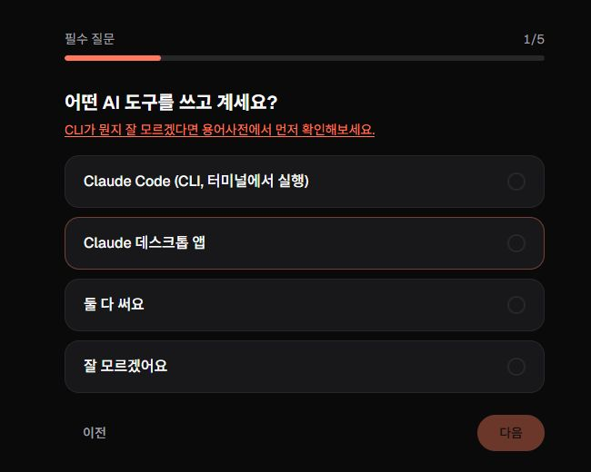
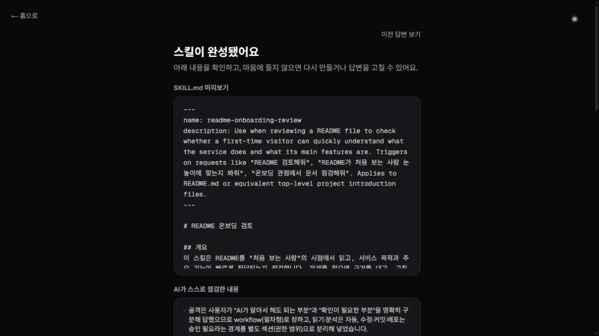

<div align="center">

# Tailor

**Write your own Claude Code Skill, with a little help from AI**

[한국어](README.md) · English


</div>

---

Claude Code has a thing called a `SKILL.md` — a file where you write down "when
this comes up, do it like this," and Claude pulls it in on its own. Handy, but
**the moment you sit down to write your first one, it is not obvious what goes
in it or in what order.**

Tailor asks those questions for you. Answer a few and you get a usable draft,
along with an explanation of why it came out the way it did.

Tailor is designed for everyone from people opening Claude Code for the first
time to experienced users who have already built skills of their own. It keeps
the technical terms and concrete values, adding a short gloss when a term first
appears. That makes it easy to start without limiting how specific you can get
once you are familiar with the workflow.

<div align="center">



<sub>Answer a few questions to build a <code>SKILL.md</code> draft tailored to you.</sub>

<br><br>



<sub>An actual generation — the finished <code>SKILL.md</code> and AI self-check are shown together.</sub>

</div>

## What it does

| | Route | Notes |
|---|---|---|
| **Glossary** | `/glossary` | 21 concepts — "skill", "agent", "CLI" — explained through plain analogies. No AI calls |
| **Skill generator** | `/create` | Answer a few questions, get a `SKILL.md` draft. The core feature |
| **Gallery** | `/gallery` | Browse and download skills worth borrowing from |

## Two paths through the generator

`/create` starts by asking how you want to build. **The two are good at
different things.**

| | Build here | Continue in your own Claude |
|---|---|---|
| Where it runs | Server runs **one or two Claude model stages** | A `claude://` deep link into **your own session** |
| Reference corpus | **Included in the prompt** | **Does not fit in a link** |
| Attribution | Shown on the result screen | Not carried |
| Your project files | Not visible | **Claude can read them while asking** |
| Cost | On the service | **On your Claude account** |

On document structure alone the web path is generally better. The app says so
on that screen, before you choose.

> **How the handoff path is told to save**
> The prompt handed to your Claude instructs it to *show a draft and get your
> approval, then ask where to save, then confirm once more before writing the
> file.* That is an instruction, not code, so it is not enforced.

## Running it yourself

```bash
pnpm install
pnpm dev
```

Opens at `http://localhost:3000`.

> [!IMPORTANT]
> **Generation needs a Claude API key.**
> Create a `.env.local` file in the repository root and put your key in it
> (see `.env.example`).
>
> ```bash
> # .env.local
> ANTHROPIC_API_KEY=sk-ant-...
> ```
>
> Keys come from [console.anthropic.com](https://console.anthropic.com).
> `CORPUS_ROUTING_MODE` in `.env.example` is optional; without it the service
> uses the default behaviour of sending the whole corpus.

Set `SUPABASE_URL` and the server-only `SUPABASE_SECRET_KEY` only when you want
operational telemetry. Generation still works without them; persistence is
skipped fail-open. The table definition lives in
`docs/operations/generations-table.sql`.

`.env.local` is covered by `.gitignore` so it is never committed. The Anthropic
key is read from `src/app/api/generate-skill/route.ts`, and the Supabase key from
`src/app/api/generate-skill/observation-store.ts`; both stay **server-only** and
never reach the browser.

Without a key, **the glossary and gallery still work normally** — both are
static pages that make no AI calls. Trying to generate from `/create` without
one returns a message saying the API key is not configured.

<details>
<summary><b>Checks</b></summary>

```bash
pnpm lint                        # Biome (lint + format)
pnpm build                       # production build
pnpm exec tsc --noEmit           # type check
pnpm lint:corpus                 # corpus authoring rules
pnpm count:audit                 # audit coverage report and document mapping check
pnpm check:parser                # response tag parser regression
pnpm check:logging               # server log allowlist regression
pnpm check:observation           # Supabase telemetry and persistence regression
pnpm check:upstream-errors       # Anthropic error classification and abort regression
pnpm check:input-limits          # input length limit regression
pnpm check:routing               # bundle selection and delivery regression
pnpm check:routing-production    # production full/routed policy regression
pnpm check:routing-eval          # routing evaluation preregistration check
pnpm check:routing-comparison    # full/routed comparison preregistration check
pnpm check:routing-fallback      # free fallback-safeguard check
pnpm check:corpus-render         # rendered corpus comparison
```

`check:routing`, `check:routing-production`, `check:routing-fallback`, and
`check:corpus-render` need `pnpm dev` running on port 3000.
`check:routing-fallback` overwrites the recorded `free-check-results.json` with
the new run, so inspect the Git diff and restore the original record afterward.
None of the checks above call a paid model API.

</details>

## The reference corpus

The generation prompt carries **"good patterns"** distilled ahead of time from
public skills. Source documents are never re-read at runtime.

`CORPUS_ROUTING_MODE` picks how they go in. The default `full` sends the whole
corpus through **one Sonnet generation stage**. For a first generation,
`routed` adds a selection stage in which Claude Haiku 4.5 picks the needed
pattern bundles, followed by a Sonnet generation stage using only that corpus.
Network, deadline, 5xx, unclassified request, and selection-processing failures
fall back to the full corpus. Billing, usage-limit, authentication, and 429
errors stop before Sonnet is called. Refinements always use `full` regardless
of the setting.

<div align="center">

| Categories | Patterns | Skeletons | Source skills |
|:---:|:---:|:---:|:---:|
| **9** | **148** | **4** | **13** |

</div>

Only the `baseline` category is injected regardless of what is being requested.

<details>
<summary><b>The rules for carrying other people's work</b></summary>

- **Sources fall into two tiers.** From a source whose license is confirmed
  (MIT / Apache-2.0), literal values are carried over. From an unconfirmed one,
  only concepts and methods are carried, restated in our own words — no
  phrasings, lists, tables or templates. **Both tiers are credited.** Omitting
  the credit would make the pattern look like ours on screen, which is the wrong
  signal.
- **Each source's repository and license is checked directly and recorded.**
  License labels from search results are not trusted. When a license cannot be
  established, the field says so — that value is shown to users, so a guess
  there would be showing them something false.
- **The credit says "patterns we distilled", not "we read the original".** Only
  what was actually used in a given generation is listed.
- **Anything credited must be traceable.** If it cannot be pointed to in the
  finished `SKILL.md`, it does not go into the credits.

The rules themselves live in the header comment of
`src/data/reference-corpus.ts`; the vetting procedure is in
`docs/corpus-sources.md`. Whether the corpus represents each source
faithfully is recorded per source under `docs/corpus/`, down to file lists, byte
counts and md5 hashes.

> This is not legal advice.

</details>

## What got written down along the way

To avoid judging quality by eye, what changed and what came of it was recorded
as it happened.

- **`docs/corpus/`** — **11 audits**, one per source, checking the corpus
  against the original. They record which files were read and how far, down to
  file lists, byte counts and md5 hashes
- **`docs/experiments/`** — **9 write-ups** plus raw data: model and setting
  comparisons, whether filling a corpus category actually changed the output,
  and a blind scoring pass on whether the attributions a generation reports are
  really present in what it produced

Conclusions later overturned are **left in place**; a correction note is
appended at the top instead. Editing the body would change what the record says
was measured. So before quoting a conclusion, **read the top of that document
first.**

## Project layout

<details>
<summary><b>Expand</b></summary>

```
src/app/                    pages + API routes
  api/generate-skill/       generation API
                            route.ts        validate input, generate, respond
                            generate.ts     one full generation flow
                            prompt.ts       prompts and corpus rendering
                            routing.ts      bundle selection and delivery list
                            routing-policy.ts / generation-routing.ts
                                            full/routed decision and safeguards
                            upstream-error.ts     Anthropic error classification
                            request-validation.ts input length and shape checks
                            telemetry.ts    what server logs may contain
                            observation.ts / observation-store.ts
                                            allowed operational telemetry and Supabase persistence
  api/route-preview/        routing preview (dev only, 404 in production)
  api/eval-ab/              evaluation harness (dev only, 404 in production)
  api/corpus-snapshot/      corpus render dump (dev only, 404 in production)
src/components/create/      wizard, result screen, handoff panel
src/data/
  reference-corpus.ts       reference corpus — patterns + document skeletons
  gallery.ts                gallery data
  glossary.ts               glossary data
  wizard-questions.ts       wizard question definitions
src/lib/
  generation-errors.ts      shared error codes, messages, and retry policy
  input-limits.ts           shared input length limits
tools/                      corpus lint/render/audit and parser/log/error/input/routing/telemetry checks
docs/corpus/                source audit records
docs/experiments/           generation-quality experiments + raw data
docs/operations/            operational telemetry schema and analysis SQL
```

</details>

## Stack

Next.js (App Router) · React · TypeScript · Tailwind CSS · pnpm · Biome
· GSAP + Framer Motion · Anthropic SDK (Claude Sonnet 5 for generation,
Claude Haiku 4.5 for corpus selection) · Supabase REST (operational telemetry)

## Attribution

The reference corpus distills patterns from **public skills other people
wrote**. Each source's author and license are recorded in
`src/data/reference-corpus.ts`, and the audits in `docs/corpus/`. The result
screen credits the sources behind the patterns actually used in that generation.

## License

© 2026 Guhn Park

The code is public, but no open-source license is granted. You are very welcome
to explore it on GitHub, experiment in a fork, or suggest a better approach
through an issue or pull request. For anything beyond that, please get in touch
first. The full text is in [`LICENSE`](LICENSE).

The patterns distilled into the reference corpus **remain under their own
sources' licenses** — authors and licenses are recorded in
`src/data/reference-corpus.ts` and `docs/corpus/`.
